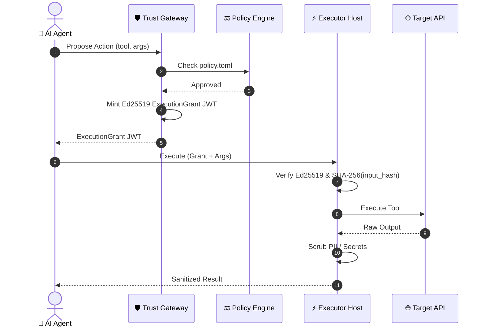

# 🛡️ Trust Gateway

[](https://www.rust-lang.org)
[](LICENSE)
[](https://nats.io)
[](https://modelcontextprotocol.io)

> **Zero-Trust Governance & Execution Control Plane for Autonomous AI Agents**

`trust-gateway` is an open-source execution authorization engine. It decouples an AI Agent's **intent to act** from the **authority to execute mutations** against real-world APIs, SaaS tools, and local execution environments.

- 🤖 **Agents propose** actions — they never execute directly
- 🛡️ **Gateway evaluates** policy rules and mints short-lived, Ed25519-signed execution grants
- ⚡ **Executors verify** grants cryptographically before executing — rejecting tampered arguments and replayed grants

---

## 🚀 Run the Standalone Demo

### Prerequisites

- **[Rust Toolchain](https://www.rust-lang.org/tools/install)** (`rustc` & `cargo` **1.88+**):
  ```bash
  curl --proto '=https' --tlsv1.2 -sSf https://sh.rustup.rs | sh
  ```
- **System Build Dependencies** (C compiler and SSL development headers):
  - **Linux (Ubuntu/Debian)**: `sudo apt-get install -y build-essential pkg-config libssl-dev`
  - **macOS**: `xcode-select --install`

> **Tip:** Run `make doctor` to verify all prerequisites are installed.

### Run the Demo

```bash
git clone https://github.com/fcn06/trust-gateway
cd trust-gateway
cargo run -p quickstart-standalone
```

> Or, equivalently: `make quickstart`

### Expected Output

```
=====================================================
🛡️ Trust Gateway Standalone Control Flow Quickstart
=====================================================
📥 1. Received ProposedAction: tool='mock_refund'
⚖️ 2. Policy Decision: approved=true, reason='Action permitted under default policy'
🔑 3. Issued ExecutionGrant: id='grant_action-demo-001', input_hash='38c23c59...'
⚡ 4. Execution Result: status=Succeeded, duration=5ms
🔒 5. Sanitized Output:
{
  "account_email": "[REDACTED]",
  "amount": "50.00",
  "status": "refund_processed"
}
=====================================================
✅ Standalone execution completed successfully!
=====================================================
```

### What Just Happened?

1. An AI agent **proposed** a refund action with specific arguments
2. The **policy engine** evaluated the action against `policy.toml` rules and approved it
3. The gateway **minted** a cryptographic `ExecutionGrant` JWT, binding the exact arguments via SHA-256 `input_hash`
4. The executor **verified** the grant signature, checked the input hash, then executed — redacting PII from the output

If the agent had tampered with the arguments after approval, step 4 would have **rejected** the execution.

---

## 📖 Choose Your Path

| Goal | Guide | Time |
| :--- | :--- | :--- |
| **Integrate via REST** | [`docs/tutorials/rest-curl-agent.md`](docs/tutorials/rest-curl-agent.md) | 10 min |
| **Integrate via Python** | [`examples/python-agent/`](examples/python-agent/) | 10 min |
| **Connect an MCP client** | [`docs/tutorials/mcp-client.md`](docs/tutorials/mcp-client.md) | 15 min |
| **Write a custom policy** | [`docs/how-to/write-policy.md`](docs/how-to/write-policy.md) | 10 min |
| **Contribute to the Rust workspace** | [`docs/getting-started.md`](docs/getting-started.md) | 15 min |
| **Understand the architecture** | [`docs/concepts/VISUAL_GUIDE.md`](docs/concepts/VISUAL_GUIDE.md) | 5 min |

---

## 🌟 Core Architecture

> **"Agents propose. Gateway decides. Executors verify."**

The architecture maps the 5 execution steps directly into 3 core pillars:

| Core Pillar | Step | Phase | Mechanism & Description |
| :--- | :---: | :--- | :--- |
| 🤖 **1. Agents Propose** | **Step 1** | **Action Proposal** | AI Agent submits a `ProposedAction` payload over NATS without direct API access. |
| 🛡️ **2. Gateway Decides** | **Step 2**<br/>**Step 3** | **Policy Evaluation**<br/>**Grant Issuance** | Evaluates rules against `policy.toml` (and human approval if required).<br/>Mints a short-lived Ed25519 `ExecutionGrant` JWT bound to `input_hash`. |
| ⚡ **3. Executors Verify** | **Step 4**<br/>**Step 5** | **Grant Verification**<br/>**Egress Scrubbing** | `executor_host` verifies Ed25519 signature, SHA-256 `input_hash`, & single-use nonce.<br/>Applies PII/secret scrubbing to output before returning result. |

<br/>

### 📐 Physical Boundaries & Component Split

```
                   ┌──────────────────────────────────────┐
                   │             AI AGENT                 │
                   └──────────────────┬───────────────────┘
                                      │ 1. Propose Action
                                      ▼
                   ┌──────────────────────────────────────┐
                   │           TRUST GATEWAY              │
                   │  - Attribute Policy Evaluator        │
                   │  - Short-Lived Ed25519 Grant Issuer  │
                   └──────────────────┬───────────────────┘
                                      │ 2. Signed ExecutionGrant JWT
                                      ▼
                   ┌──────────────────────────────────────┐
                   │            EXECUTOR HOST             │
                   │  - Verify Ed25519 Grant Signature    │
                   │  - Verify SHA-256 input_hash         │
                   │  - Check Single-Use Nonces           │
                   └──────────────────┬───────────────────┘
                                      │ 3. PII Sanitized Result
                                      ▼
                   ┌──────────────────────────────────────┐
                   │              SAAS / API              │
                   └──────────────────────────────────────┘
```

<br/>

### 📊 End-to-End Sequence Diagram



---

## 📄 Governance Policy (`policy.toml`)

```toml
[governance]
policy_version = "1.0.0"
default_action = "deny"

[[rules]]
name = "Auto-allow read-only queries"
operation_kind = "read_only"
action = "allow"
priority = 10

[[rules]]
name = "Require approval for financial operations"
operation_kind = "financial_mutation"
action = "require_approval"
min_amount_cents = 10000
priority = 20
```

---

## 📜 Security Invariants

1. **No Direct Execution**: Agents never execute actions directly; all mutations require an `ExecutionGrant`.
2. **Cryptographic Binding**: Grants contain SHA-256 `input_hash` of exact arguments to prevent post-approval parameter tampering.
3. **Single-Use Replay Prevention**: Nonce tracking guarantees a grant cannot be executed twice.
4. **JWT Class Separation**: Session JWTs are strictly prohibited from acting as Execution Grants.
5. **Fail-Closed Default**: Unrecognized tools or missing policies default to `deny` or `read_only`.
6. **Asymmetric Production Signing**: Ed25519 asymmetric grant signing is required in production (`LIANXI_ENV=production`), with HMAC symmetric signing strictly gated to `LIANXI_ENV=development` and hard boot-time refusal otherwise.

---

## 📚 Documentation

### Tutorials — Learn by Doing

- **[`docs/tutorials/rest-curl-agent.md`](docs/tutorials/rest-curl-agent.md)**: Integrate an agent via REST using `curl`
- **[`docs/tutorials/mcp-client.md`](docs/tutorials/mcp-client.md)**: Connect an MCP client

### How-To Guides — Accomplish a Task

- **[`docs/how-to/write-policy.md`](docs/how-to/write-policy.md)**: Author governance policies
- **[`docs/how-to/add-tool.md`](docs/how-to/add-tool.md)**: Register a custom executor tool
- **[`docs/how-to/require-approval.md`](docs/how-to/require-approval.md)**: Set up human-in-the-loop approval

### Concepts — Understand the Architecture

- **[`docs/concepts/VISUAL_GUIDE.md`](docs/concepts/VISUAL_GUIDE.md)**: 🎨 5-Minute Visual Guide & Concepts
- **[`docs/concepts/ARCHITECTURE.md`](docs/concepts/ARCHITECTURE.md)**: Architectural plane breakdown
- **[`docs/concepts/DEPLOYMENT_TOPOLOGY.md`](docs/concepts/DEPLOYMENT_TOPOLOGY.md)**: Deployment separation model
- **[`docs/concepts/EXECUTION_EXAMPLE.md`](docs/concepts/EXECUTION_EXAMPLE.md)**: Real-world execution flow example
- **[`docs/concepts/EXPLAINED_FOR_KIDS.md`](docs/concepts/EXPLAINED_FOR_KIDS.md)**: 🎈 Trust Gateway explained for a 10-year-old

### Reference — Precise Contracts

- **[`docs/reference/PROTOCOL_SPEC.md`](docs/reference/PROTOCOL_SPEC.md)**: Open Execution Authorization Protocol specification
- **[`docs/reference/security-guarantees.md`](docs/reference/security-guarantees.md)**: Security guarantees classification matrix
- **[`docs/reference/NATS_TOPOLOGY.md`](docs/reference/NATS_TOPOLOGY.md)**: Messaging topology principles

### Contributor Guide

- **[`docs/getting-started.md`](docs/getting-started.md)**: Build, test, and contribute to the Rust workspace

---

## 📦 Workspace Structure

### Core Domain Logic & Technology Adapters
- **[`crates/`](crates/)** (Domain-Driven Security Logic):
  - `trust-model`: Canonical data models (`ProposedAction`, `ExecutionGrant`, `TransactionOutcomeState`, `OperationAttributes`).
  - `trust-canonical`: Deterministic JSON key sorting & SHA-256 `input_hash` calculation.
  - `trust-auth`: Scoped JWT signature verifiers & class isolation.
  - `trust-policy`: Priority-ordered attribute-based policy evaluation engine.
  - `trust-grants`: Ed25519 `ExecutionGrant` minting & replay-nonce tracking.
  - `trust-audit`: Hash-chained audit log generator.
  - `trust-egress`: PII redacting regex scrubbing engine & response bounds validator.
  - `trust-executor-sdk`: Abstract `Executor` trait & crash reconciliation handler.
  - `trust-reference-executor`: Zero-dependency mock executor for local testing.

- **[`adapters/`](adapters/)** (Technology Transports & Storage):
  - `transport-nats`: Decoupled NATS pub/sub message router.
  - `storage-nats-kv`: NATS JetStream key-value state adapter.

### Control Plane Executables & Routers
- **[`gateway/`](gateway/)**: Control plane daemon binary (main router, policy evaluator, and approval daemon).
- **[`executor_host/`](executor_host/)**: Hardened execution runtime daemon dispatching execution profiles (`native-tool`, `connector`, `vp`).
- **[`platform/`](platform/)**: Edge routing infrastructure:
  - `global_domain/public_gateway`: Ingress edge router bridging A2A requests over NATS.
  - `tenant_registry`: Directory store mapping public DID identities to workspace tenants.
  - `tenant_context`: Multi-tenant credentials schemas and configuration metadata.
- **[`shared_libs/`](shared_libs/)**: Facade libraries re-exporting domain crates (`trust_core`, `trust_policy`, `trust_auth`).
- **[`connector_mcp_server/`](connector_mcp_server/)**: Standalone HTTP OAuth2 callback redirect server.

### Tools, Testing & Specifications
- **[`native_tools/`](native_tools/)**: Sandboxed shell and python execution scripts.
- **[`verifier/`](verifier/)**: Zero-dependency standalone Ed25519 execution grant verification crate.
- **[`policy-sdk/`](policy-sdk/)**: Policy rules parser and validation SDK.
- **[`trust_ops/`](trust_ops/)**: Operational utilities and administrative tools.
- **[`trustctl/`](trustctl/)**: CLI management utility (`policy lint`, `policy simulate`, `audit verify`).
- **[`conformance/`](conformance/)**: Test suite runner for security invariants and grant vector verification.
- **[`examples/`](examples/)**: Standalone quickstart, REST, Python, and Kubernetes deployment examples.
- **[`protocol/`](protocol/)**: Protocol specification documents for A2A and execution grant formats.
- **[`security/`](security/)**: Security policies, threat assessments, and security invariants.
- **[`threat-model/`](threat-model/)**: Threat modeling diagrams and attack surface analysis.
- **[`test-vectors/`](test-vectors/)**: JSON test vector files for grant verification and input binding.
- **[`tests/`](tests/)**: Integration and regression test suites.
- **[`config/`](config/)**: Deployment configuration files and policy templates.
- **[`deploy/`](deploy/)**: Docker Compose and deployment assets.

---

## 📡 Available API Interfaces & Transports

`trust-gateway` provides multiple standardized API transports for seamless integration with AI agents, governance dashboards, and executor runtimes:

| Interface / Transport | Endpoint / Channel | Protocol & Description |
| :--- | :--- | :--- |
| **🔌 MCP (Model Context Protocol)** | `GET /v1/mcp/sse`<br/>`POST /v1/mcp/messages` | **MCP over HTTP SSE / Streamable**: Enables AI clients (Claude Desktop, Cursor, Custom LLM Agents) to dynamically discover governed tools (`tools/list`) and submit tool calls (`tools/call`). |
| **🌐 REST / HTTP API** | `POST /v1/actions/propose`<br/>`GET /v1/tools/list` | **Standard JSON REST API**: Direct HTTP endpoints for proposing actions, fetching tool definitions, and monitoring service health (`GET /health`). |
| **📨 A2A / NATS Event Protocol** | `trust.v1.*.action.propose`<br/>`trust.v1.*.tools.list` | **Agent-to-Agent Pub/Sub over NATS**: High-performance, decoupled event transport for async agent proposals and real-time JetStream audit streaming. |
| **👤 Human Approval API** | `GET /v1/approvals`<br/>`POST /v1/approvals/:id/decision` | **Human-in-the-Loop Governance**: API endpoints for administrative portals and human reviewers to list pending escalations and submit approval/denial decisions. |
| **🔐 OAuth2 & OIDC Discovery** | `/.well-known/openid-configuration`<br/>`/.well-known/oauth-protected-resource` | **Identity & OAuth Proxy**: Standardized OpenID & OAuth2 metadata discovery endpoints for third-party connector authentication workflows. |

---

## 🧰 Development

```bash
make doctor       # Check prerequisites
make check        # Compile workspace
make test         # Run unit tests
make quickstart   # Run standalone demo
make conformance  # Run protocol conformance vectors
make lint         # Check formatting & clippy
make audit        # CLI audit verification
```
