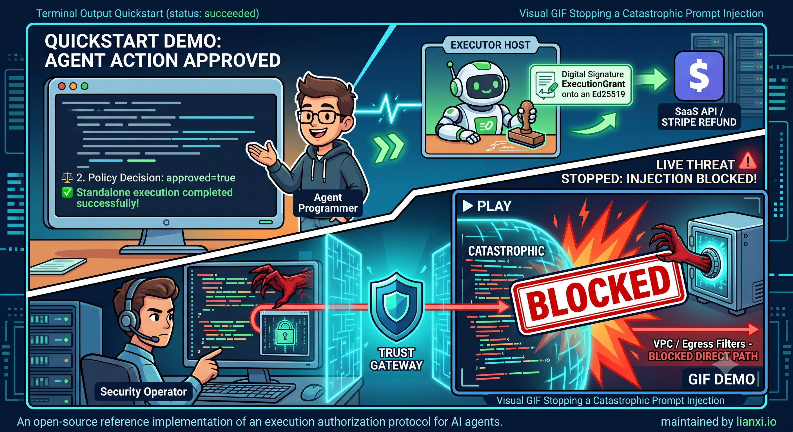

# 🛡️ Trust Gateway



[](https://www.rust-lang.org)
[](LICENSE)
[](https://nats.io)
[](https://modelcontextprotocol.io)

> **An open-source gateway and reference implementation of an execution authorization protocol for AI agents.**

AI agents should be able to propose actions without automatically possessing the authority to execute them.

**Trust Gateway** sits between AI agents and side-effecting tools and systems (SaaS APIs, databases, native scripts). It evaluates proposed actions against deterministic policy rules and issues a short-lived, Ed25519-signed **ExecutionGrant** cryptographically bound to exactly one tool and one set of canonical parameters. 

Executors independently verify that grant before performing any mutation.

> **"Agents propose. Gateway decides. Executors verify."**

```text
                               ┌─────────────────────────┐
                               │       AI AGENT          │
                               └────────────┬────────────┘
                                            │ 1. Propose tool + args
                                            ▼
                               ┌─────────────────────────┐
                               │      TRUST GATEWAY      │
                               │ - Identity & Policy     │
                               │ - Approval & Grant Mint │
                               └────────────┬────────────┘
                                            │ 2. Short-lived ExecutionGrant
                                            ▼
                               ┌─────────────────────────┐
                               │      EXECUTOR HOST      │
                               │ - Ed25519 & Hash Verify │
                               │ - Execute Mutation      │
                               └────────────┬────────────┘
                                            │ 3. Execute mutation
                                            ▼
                               ┌─────────────────────────┐
                               │   TARGET SAAS / API     │
                               └─────────────────────────┘
```

---

## 📜 Protocol vs. Reference Implementation

The **Execution Authorization Protocol** defines normative authorization contracts independent of specific runtime components:
* **Normative Schemas**: `ProposedAction`, `PolicyDecision`, `ExecutionGrant`, `GrantedAction`, `ExecutionResult`.
* **Canonicalization & Hashing**: Deterministic canonical JSON serialization with lexicographically sorted object keys followed by SHA-256 hashing (`input_hash`).
* **Verification Rules**: Ed25519 public key signature verification, single-use nonce checking (`jti`), and strict TTL expiration.

### `ExecutionGrant` Core Claims

An `ExecutionGrant` is a short-lived Ed25519-signed JWT. The protocol requires the following core claims:

```json
{
  "iss": "trust-gateway",
  "aud": "executor-host",
  "sub": "agent-001",
  "iat": 1740000000,
  "nbf": 1740000000,
  "exp": 1740000030,
  "jti": "grant-550e8400-e29b-41d4-a716-446655440000",
  "tenant_id": "tenant_demo",
  "tool_name": "io.example.refund@v1",
  "input_hash": "sha256:<64-hex-character-digest>",
  "policy_fingerprint": "sha256:<64-hex-character-digest>"
}
```

The grant authorizes one execution of one versioned tool with exactly one canonical argument set. Executors must reject expired grants, invalid signatures, reused `jti` values, mismatched tool identities, or mismatched argument hashes.

> **Note on `tool_name`**: `tool_name` is the canonical, versioned tool identifier used by the protocol and executor (e.g. `"io.example.refund@v1"`).

This repository provides the official **Rust reference implementation**:
* Reference **Gateway** policy decision point and grant issuer (`gateway/`)
* Reference **Executor Host** runner (`executor_host/`) and standalone verifier library (`verifier/`)
* Protocol **Test Vectors** (`test-vectors/`) and **Conformance Suite** (`conformance/`)

> **Transport Agnosticism**: NATS JetStream is the default transport and state backend of the reference implementation, but it is not a requirement of the authorization protocol itself.

---

## 🚀 Quickstart

Choose your preferred way to test and evaluate Trust Gateway:

### Path 1: Fastest — Docker Demo (No Rust toolchain required)

The demo container is statically compiled against `musl` (~5 MB download / ~18 MB uncompressed).

Build and run the standalone demonstration locally in Docker:

```bash
# 1. Build local container image (or run: make demo-docker)
docker build -t trust-gateway-demo -f deploy/Dockerfile.demo .
# Tip: Prefix with BUILDPROVENANCE=false for a completely silent BuildKit build

# 2. Run standard execution demo
docker run --rm trust-gateway-demo

# 3. Simulate parameter tampering post-approval (BLOCKED live by executor)
docker run --rm trust-gateway-demo --tamper

# 4. Simulate grant replay attack (BLOCKED live by single-use nonce)
docker run --rm trust-gateway-demo --replay
```

### Path 2: Source Build (Rust 1.88+)

Run the standalone quickstart demo directly from source:

```bash
# Prerequisites: Rust 1.88+, build-essential / xcode-select, libssl-dev
cargo run -p quickstart-standalone

# Test attack simulations:
cargo run -p quickstart-standalone -- --tamper
cargo run -p quickstart-standalone -- --replay
```

<details>
<summary><b>View Standalone Demo Execution Output</b></summary>

```text
=====================================================
🛡️ Trust Gateway Standalone Control Flow Quickstart
=====================================================
📥 1. Received ProposedAction: tool='mock_refund'
⚖️ 2. Policy Decision: approved=true, reason='Action permitted under default policy'
🔑 3. Issued ExecutionGrant: id='grant_action-demo-001', input_hash='38c23c59...'
⚡ 4. Execution Result: status=Succeeded, duration=5ms
🔒 5. Sanitized Output:
{
  "account_email": "[REDACTED]",
  "amount": "50.00",
  "status": "refund_processed"
}
=====================================================
✅ Standalone execution completed successfully!
=====================================================
```
</details>

### Path 3: Full Platform Mode (Docker Compose)

Spin up the complete distributed topology (NATS JetStream + Gateway + Executor Host):

```bash
docker compose -f deploy/docker-compose.yml up -d
```

---

## 🔌 Quick Integration Example

How does an AI agent propose an action to Trust Gateway over HTTP?

> **Prerequisite**: Start the Trust Gateway server first using **Path 3 (Docker Compose)**: `docker compose -f deploy/docker-compose.yml up -d` (or run `cargo run -p gateway`). This exposes the HTTP API on port `3060`.
>
> **Field Naming Note**: The HTTP REST proposal payload uses `action_name` to specify the requested tool (e.g. `"action_name": "claw_hello_world"`). The Gateway populates this into internal domain models and `ExecutionGrant` JWT claims under `tool_name`.

### 1. Agent Proposes Action

```bash
# Generate a development session JWT (HMAC-HS256 using dev secret):
HEADER=$(echo -n '{"alg":"HS256","typ":"JWT"}' | base64 -w0 | tr -d '=' | tr '/+' '_-')
PAYLOAD=$(echo -n '{"sub":"agent-001","exp":1999999999,"tenant_id":"tenant_demo"}' | base64 -w0 | tr -d '=' | tr '/+' '_-')
SECRET="dev-secret-do-not-use-in-production-1234567890"
SIGNATURE=$(echo -n "${HEADER}.${PAYLOAD}" | openssl dgst -sha256 -hmac "${SECRET}" -binary | base64 -w0 | tr -d '=' | tr '/+' '_-')
export SESSION_TOKEN="${HEADER}.${PAYLOAD}.${SIGNATURE}"

curl -X POST http://localhost:3060/v1/actions/propose \
  -H "Authorization: Bearer $SESSION_TOKEN" \
  -H "Content-Type: application/json" \
  -d '{
    "action_name": "claw_hello_world",
    "arguments": {
      "message": "Hello from agent"
    }
  }'
```

### 2. Gateway Execution Response

The Gateway evaluates policy, mints an Ed25519 `ExecutionGrant`, dispatches execution to `executor-host`, scrubs the result, and returns the execution outcome:

```json
{
  "action_id": "7a636adf-bc8a-4305-a1a3-7c772bc8b27a",
  "status": "succeeded",
  "result": [
    {
      "text": "{\n  \"action_id\": \"7a636adf-bc8a-4305-a1a3-7c772bc8b27a\",\n  \"result\": \"Hello from agent\",\n  \"skill\": \"claw_hello_world\"\n}",
      "type": "text"
    }
  ]
}
```

---

## 🔒 Required Deployment Invariants

For Trust Gateway's security guarantees to hold in production, deployments **must** enforce these 5 physical invariants:

1. **Agents Hold No Credentials**: AI agents do not possess standing SaaS credentials, API keys, or database connection strings.
2. **Executors Are Sole Mutation Boundary**: Executor hosts are the only components network-authorized to mutate target systems.
3. **Agent-to-SaaS Paths Are Blocked**: Direct network paths between agent runtime nodes and SaaS endpoints are blocked by firewall or VPC rules.
4. **Mandatory Grant Verification**: Executor hosts refuse any execution attempt that lacks a valid, signed, single-use `ExecutionGrant`.
5. **Gateway-Only Grant Keys**: Ed25519 grant signing keys reside exclusively within the Gateway control plane.

```text
❌ FORBIDDEN DIRECT PATH (Blocked by VPC / Egress Filters):
   AI Agent ═════════════════════════════════════════════> Target SaaS API (BLOCKED)

✅ AUTHORIZED GOVERNED PATH:
   AI Agent ──► Trust Gateway ──► ExecutionGrant ──► Executor Host ──► Target SaaS API
```

---

## 🛡️ Security Properties & Boundaries

### Security Guarantees Matrix

| Security Property | Guaranteed under Invariants | Control Mechanism / Notes |
| :--- | :---: | :--- |
| **Grant Authenticity** | **Yes** | Ed25519 signature verification against Gateway public key |
| **Argument Integrity** | **Yes** | SHA-256 `input_hash` binding verification at Executor boundary |
| **Replay Protection** | **Yes** | Atomic single-use `jti` consumption in a durable nonce store shared by all executor instances |
| **Class Separation** | **Yes** | Session JWT tokens strictly rejected as execution grants |
| **Credential Removal** | **Yes** | Agents possess zero standing SaaS credentials |
| **Argument Semantic Correctness** | **No** | Policy checks compliance; LLM argument semantics are out-of-scope |
| **Tool Implementation Safety** | **No** | Requires host-level sandboxing (Wasmtime / Docker) for untrusted code |
| **Provider-Side Exactly-Once Execution** | **No** | Retries depend on target SaaS provider idempotency header support |
| **Protection Without Network Isolation** | **No** | Requires VPC egress rules preventing direct agent-to-SaaS connections |

### Threat Mitigation Matrix

| Vulnerability or Threat | Control Mechanism |
| :--- | :--- |
| **Prompt injection influences agent intent** | Proposed action still requires independent policy evaluation, identity check, and grant verification. |
| **Arguments tampered after approval** | SHA-256 `input_hash` verification fails at the executor boundary. |
| **Grant replayed by malicious actor** | Atomic single-use `jti` consumption in a shared durable nonce store rejects replay attempts. |
| **Session JWT used as execution grant** | JWT class separation strictly rejects non-grant token types. |
| **Agent runtime node compromised** | Agent holds no standing SaaS credentials. Grants remain short-lived and bound to one parameter hash. |
| **Unknown or unregistered tool invocation** | Fail-closed default policy denies proposal immediately. |
| **Executor receives forged grant** | Ed25519 public key signature verification fails. |
| **Crash during execution** | Nonce store records consumption prior to execution. Network retry idempotency relies on provider-side keys. |

### Conformance Suite Verification

CI continuously verifies protocol security invariants via [`conformance/`](conformance/):
- ✓ Rejects modified parameters (`input_hash` mismatch)
- ✓ Rejects expired grants
- ✓ Rejects replayed grants (nonce consumed)
- ✓ Rejects wrong tool binding
- ✓ Rejects session JWT as execution grant
- ✓ Rejects HMAC grants in production mode (`LIANXI_ENV=production`)

---

## 🚫 What Trust Gateway Is Not

- **Not an LLM prompt firewall**: It operates at the deterministic execution boundary, not on conversation text.
- **Not a judge of reasoning correctness**: It evaluates policy compliance, not whether an agent's multi-step plan is optimal.
- **Not a replacement for network isolation**: It assumes agents are network-isolated from direct SaaS endpoints.
- **Not a blanket safe container for native scripts**: Arbitrary script execution requires host-level sandboxing (e.g., Wasmtime or Docker).

→ Read full system boundaries: [`docs/concepts/LIMITATIONS.md`](docs/concepts/LIMITATIONS.md)

---

## 📄 Governance Policy (`policy.toml`)

```toml
[governance]
policy_version = "1.0.0"
default_action = "deny"

[[rules]]
name = "Auto-allow read-only queries"
operation_kind = "read_only"
action = "allow"
priority = 10

[[rules]]
name = "Require human approval for financial operations"
operation_kind = "financial_mutation"
action = "require_approval"
min_amount_cents = 10000
priority = 20
```

---

## 📖 Choose Your Path

| Goal | Resource / Guide |
| :--- | :--- |
| **Protocol Specification** | [`docs/reference/PROTOCOL_SPEC.md`](docs/reference/PROTOCOL_SPEC.md) |
| **Architecture Deep-Dive** | [`docs/concepts/ARCHITECTURE.md`](docs/concepts/ARCHITECTURE.md) |
| **Integrate via REST** | [`docs/tutorials/rest-curl-agent.md`](docs/tutorials/rest-curl-agent.md) |
| **Integrate via Python** | [`examples/python-agent/`](examples/python-agent/) |
| **Connect an MCP Client** | [`docs/tutorials/mcp-client.md`](docs/tutorials/mcp-client.md) |
| **Write a Custom Policy** | [`docs/how-to/write-policy.md`](docs/how-to/write-policy.md) |
| **Deployment Invariants** | [`docs/concepts/DEPLOYMENT_TOPOLOGY.md`](docs/concepts/DEPLOYMENT_TOPOLOGY.md) |
| **System Limitations** | [`docs/concepts/LIMITATIONS.md`](docs/concepts/LIMITATIONS.md) |
| **Contribute Code** | [`docs/getting-started.md`](docs/getting-started.md) |

---

## 🧰 Development

```bash
make doctor       # Verify prerequisites
make check        # Check workspace compilation
make test         # Run unit tests
make quickstart   # Run standalone demo
make demo-docker  # Build demo Docker image
make conformance  # Run protocol conformance vectors
make lint         # Run clippy & cargo fmt checks
```

---

Maintained by [lianxi.io](https://lianxi.io). Security disclosures: [`SECURITY.md`](SECURITY.md).
