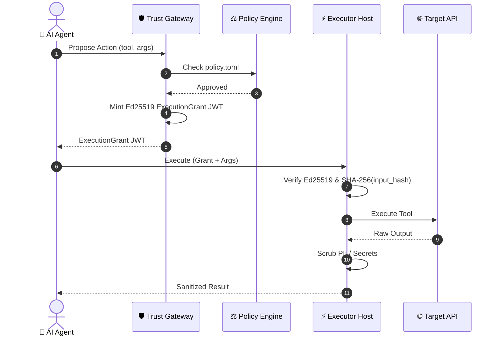

# 🛡️ Trust Gateway

[](https://www.rust-lang.org)
[](LICENSE)
[](https://nats.io)
[](https://modelcontextprotocol.io)

> **Zero-Trust Governance & Execution Control Plane for Autonomous AI Agents**

`trust-gateway` is an open-source, technology-neutral execution authorization engine. It decouples an AI Agent's **intent to act** from the **authority to execute mutations** against real-world APIs, SaaS tools, and local execution environments.

---

## 📡 Available API Interfaces & Transports

`trust-gateway` provides multiple standardized API transports for seamless integration with AI agents, governance dashboards, and executor runtimes:

| Interface / Transport | Endpoint / Channel | Protocol & Description |
| :--- | :--- | :--- |
| **🔌 MCP (Model Context Protocol)** | `GET /v1/mcp/sse`<br/>`POST /v1/mcp/messages` | **MCP over HTTP SSE / Streamable**: Enables AI clients (Claude Desktop, Cursor, Custom LLM Agents) to dynamically discover governed tools (`tools/list`) and submit tool calls (`tools/call`). |
| **🌐 REST / HTTP API** | `POST /v1/actions/propose`<br/>`GET /v1/tools/list` | **Standard JSON REST API**: Direct HTTP endpoints for proposing actions, fetching tool definitions, and monitoring service health (`GET /health`). |
| **📨 A2A / NATS Event Protocol** | `trust.v1.*.action.propose`<br/>`trust.v1.*.tools.list` | **Agent-to-Agent Pub/Sub over NATS**: High-performance, decoupled event transport for async agent proposals and real-time JetStream audit streaming. |
| **👤 Human Approval API** | `GET /v1/approvals`<br/>`POST /v1/approvals/:id/decision` | **Human-in-the-Loop Governance**: API endpoints for administrative portals and human reviewers to list pending escalations and submit approval/denial decisions. |
| **🔐 OAuth2 & OIDC Discovery** | `/.well-known/openid-configuration`<br/>`/.well-known/oauth-protected-resource` | **Identity & OAuth Proxy**: Standardized OpenID & OAuth2 metadata discovery endpoints for third-party connector authentication workflows. |

---

## 🌟 Core Architecture

> **"Agents propose. Gateway decides. Executors verify."**

The architecture maps the 5 execution steps directly into 3 core pillars:

| Core Pillar | Step | Phase | Mechanism & Description |
| :--- | :---: | :--- | :--- |
| 🤖 **1. Agents Propose** | **Step 1** | **Action Proposal** | AI Agent submits a `ProposedAction` payload over NATS without direct API access. |
| 🛡️ **2. Gateway Decides** | **Step 2**<br/>**Step 3** | **Policy Evaluation**<br/>**Grant Issuance** | Evaluates rules against `policy.toml` (and human approval if required).<br/>Mints a short-lived Ed25519 `ExecutionGrant` JWT bound to `input_hash`. |
| ⚡ **3. Executors Verify** | **Step 4**<br/>**Step 5** | **Grant Verification**<br/>**Egress Scrubbing** | `executor_host` verifies Ed25519 signature, SHA-256 `input_hash`, & single-use nonce.<br/>Applies PII/secret scrubbing to output before returning result. |

<br/>

### 📐 Physical Boundaries & Component Split

```
                   ┌──────────────────────────────────────┐
                   │             AI AGENT                 │
                   └──────────────────┬───────────────────┘
                                      │ 1. Propose Action
                                      ▼
                   ┌──────────────────────────────────────┐
                   │           TRUST GATEWAY              │
                   │  - Attribute Policy Evaluator        │
                   │  - Short-Lived Ed25519 Grant Issuer  │
                   └──────────────────┬───────────────────┘
                                      │ 2. Signed ExecutionGrant JWT
                                      ▼
                   ┌──────────────────────────────────────┐
                   │            EXECUTOR HOST             │
                   │  - Verify Ed25519 Grant Signature    │
                   │  - Verify SHA-256 input_hash         │
                   │  - Check Single-Use Nonces           │
                   └──────────────────┬───────────────────┘
                                      │ 3. PII Sanitized Result
                                      ▼
                   ┌──────────────────────────────────────┐
                   │              SAAS / API              │
                   └──────────────────────────────────────┘
```

<br/>

### 📊 End-to-End Sequence Diagram

The sequence diagram below details the exact interaction flow between the Reasoning Runtime, Governance Gateway, Policy Engine, Executor Host, and Target API:



---

## ⚡ Quickstart (Under 1 Minute)

### 📋 Prerequisites

To build and run `trust-gateway`:

- **[Rust Toolchain](https://www.rust-lang.org/tools/install)** (`rustc` & `cargo` **1.75+**):
  ```bash
  curl --proto '=https' --tlsv1.2 -sSf https://sh.rustup.rs | sh
  ```
- **System Build Dependencies**: C compiler and SSL headers for native cryptographic dependencies (e.g. `build-essential`, `pkg-config`, `libssl-dev` on Linux, or Xcode Command Line Tools on macOS).

---

Run the zero-dependency standalone control flow example:

```bash
cd trust-gateway
cargo run -p quickstart-standalone
```

### Running Tests

```bash
cargo test --workspace --lib
```

---

## 📄 Governance Policy (`policy.toml`)

```toml
[governance]
policy_version = "1.0.0"
default_action = "deny"

[[rules]]
name = "Auto-allow read-only queries"
operation_kind = "read_only"
action = "allow"
priority = 10

[[rules]]
name = "Require approval for financial operations"
operation_kind = "financial_mutation"
action = "require_approval"
min_amount_cents = 10000
priority = 20
```

---

## 📜 Security Invariants

1. **No Direct Execution**: Agents never execute actions directly; all mutations require an `ExecutionGrant`.
2. **Cryptographic Binding**: Grants contain SHA-256 `input_hash` of exact arguments to prevent post-approval parameter tampering.
3. **Single-Use Replay Prevention**: Nonce tracking guarantees a grant cannot be executed twice.
4. **JWT Class Separation**: Session JWTs are strictly prohibited from acting as Execution Grants.
5. **Fail-Closed Default**: Unrecognized tools or missing policies default to `deny` or `read_only`.

---

## 📚 Documentation

The [`docs/`](docs/) directory contains in-depth architectural and technical specifications:

- **[`docs/QUICKSTART.md`](docs/QUICKSTART.md)**: Detailed workspace compilation, zero-dependency standalone control flow execution, and CLI audit verification commands.
- **[`docs/VISUAL_GUIDE.md`](docs/VISUAL_GUIDE.md)**: 🎨 **5-Minute Visual Guide & Concepts**: Problem statement, Mermaid architecture diagrams, concept breakdown, and Rosetta Stone component mapping.
- **[`docs/EXECUTION_EXAMPLE.md`](docs/EXECUTION_EXAMPLE.md)**: Real-World Execution Flow Example detailing how `@agent Inspect the schema of the "sales" dataset.` flows through proposal, policy evaluation, human approval, grant minting, sandboxed execution, and PII egress scrubbing.
- **[`docs/ARCHITECTURE.md`](docs/ARCHITECTURE.md)**: Architectural plane breakdown framed around the 3 core pillars (Agents Propose, Gateway Decides, Executors Verify) and domain crate responsibilities.
- **[`docs/DEPLOYMENT_TOPOLOGY.md`](docs/DEPLOYMENT_TOPOLOGY.md)**: Public Edge (Server 1) vs Sovereign Core (Server 2) physical deployment topology detailing stateless public edge ingress (`platform/`) and private governance execution (`gateway/` & `executor_host/`).
- **[`docs/PROTOCOL_SPEC.md`](docs/PROTOCOL_SPEC.md)**: Open Execution Authorization Protocol specification detailing domain model contracts (`crates/trust-model`), RFC 8785 JSON canonicalization & SHA-256 `input_hash` calculation (`crates/trust-canonical`), and schema contracts.
- **[`docs/NATS_TOPOLOGY.md`](docs/NATS_TOPOLOGY.md)**: Network topology, NATS subject routing matrix, leaf node peering between Public Edge and Sovereign Core, and JetStream storage key rules.
- **[`docs/security-guarantees.md`](docs/security-guarantees.md)**: Security Guarantees classification matrix detailing Cryptographic, Deterministic, and Technical security properties mapped to their underlying domain modules.
- **[`docs/EXPLAINED_FOR_KIDS.md`](docs/EXPLAINED_FOR_KIDS.md)**: 🎈 **Trust Gateway Explained for a 10-Year-Old**: A fun, easy-to-understand breakdown of AI agent safety, golden tickets, policy rules, and execution guards using simple real-world analogies.

---

## 📦 Workspace Structure

### Core Domain Logic & Technology Adapters
- **`crates/` (Domain-Driven Security Logic)**:
  - `trust-model`: Canonical data models (`ProposedAction`, `ExecutionGrant`, `TransactionOutcomeState`, `OperationAttributes`).
  - `trust-canonical`: Deterministic JSON key sorting & SHA-256 `input_hash` calculation.
  - `trust-auth`: Scoped JWT signature verifiers & class isolation.
  - `trust-policy`: Priority-ordered attribute-based policy evaluation engine.
  - `trust-grants`: Ed25519 `ExecutionGrant` minting & replay-nonce tracking.
  - `trust-audit`: Hash-chained audit log generator.
  - `trust-egress`: PII redacting regex scrubbing engine & response bounds validator.
  - `trust-executor-sdk`: Abstract `Executor` trait & crash reconciliation handler.
  - `trust-reference-executor`: Zero-dependency mock executor for local testing.

- **`adapters/` (Technology Transports & Storage)**:
  - `transport-nats`: Decoupled NATS pub/sub message router.
  - `storage-nats-kv`: NATS JetStream key-value state adapter.

### Control Plane Executables & Routers
- **`gateway/`**: Control plane daemon binary (main router, policy evaluator, and approval daemon).
- **`executor_host/`**: Hardened execution runtime daemon dispatching execution profiles (`native-tool`, `connector`, `vp`).
- **`platform/`**: Edge routing infrastructure:
  - `global_domain/public_gateway`: Ingress edge router bridging A2A requests over NATS.
  - `tenant_registry`: Directory store mapping public DID identities to workspace tenants.
  - `tenant_context`: Multi-tenant credentials schemas and configuration metadata.
- **`shared_libs/`**: Facade libraries re-exporting domain crates (`trust_core`, `trust_policy`, `trust_auth`, `identity_context`, `community_adapters`, `ssi_crypto`).
- **`connector_mcp_server/`**: Standalone HTTP OAuth2 callback redirect server (port 3050).

### Tools, Testing & Specifications
- **`native_tools/`**: Sandboxed shell and python execution scripts (`inspect_schema`, `compute_statistics`, `detect_anomalies`, `generate_markdown`, `join_datasets`, `sample_rows`, `claw_weather`, etc.).
- **`verifier/`**: Zero-dependency standalone Ed25519 execution grant verification crate.
- **`policy-sdk/`**: Policy rules parser and validation SDK.
- **`trust_ops/`**: Operational utilities and administrative tools.
- **`trustctl/`**: CLI management utility (`policy lint`, `policy simulate`, `audit verify`).
- **`conformance/`**: Test suite runner for security invariants and grant vector verification.
- **`examples/`**: Standalone quickstart demonstration (`quickstart_standalone`).
- **`protocol/`**: Protocol specification documents for A2A and execution grant formats.
- **`security/`**: Security policies, threat assessments, and security invariants.
- **`threat-model/`**: Threat modeling diagrams and attack surface analysis.
- **`docs/`**: Architecture specifications and API reference guides.
- **`test-vectors/`**: JSON test vector files for grant verification and input binding.
- **`tests/`**: Integration and regression test suites.
- **`config/`**: Deployment configuration files and policy templates (`policy.standalone.toml`).
- **`deploy/`**: Docker Compose (`docker-compose.yml`) and systemd deployment assets.
