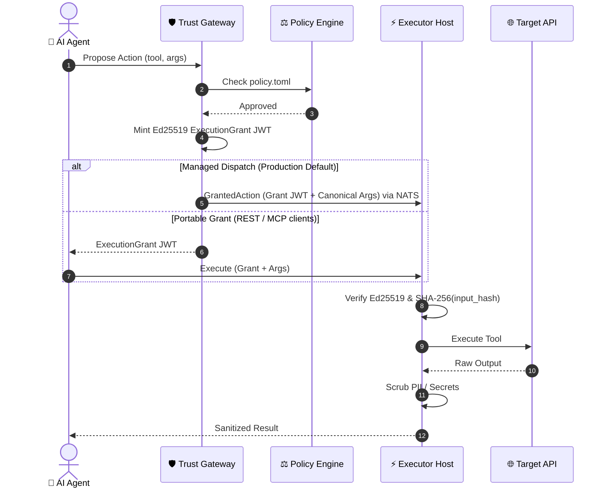

# 🛡️ Trust Gateway

[](https://www.rust-lang.org)
[](LICENSE)
[](https://nats.io)
[](https://modelcontextprotocol.io)

> **Zero-Trust Governance & Execution Control Plane for Autonomous AI Agents**

`trust-gateway` is an open-source **transaction authorization protocol for AI agents**. It creates portable, short-lived execution authorizations cryptographically bound to one tool invocation and independently verified at the execution boundary — decoupling an agent's **intent to act** from the **authority to execute mutations**.

- 🤖 **Agents propose** actions — they never execute directly
- 🛡️ **Gateway evaluates** policy rules and mints short-lived, Ed25519-signed execution grants
- ⚡ **Executors verify** grants cryptographically before executing — rejecting tampered arguments and replayed grants

---

## 🚀 Run the Standalone Demo

### Prerequisites

- **[Rust Toolchain](https://www.rust-lang.org/tools/install)** (`rustc` & `cargo` **1.88+**):
  ```bash
  curl --proto '=https' --tlsv1.2 -sSf https://sh.rustup.rs | sh
  ```
- **System Build Dependencies** (C compiler and SSL development headers):
  - **Linux (Ubuntu/Debian)**: `sudo apt-get install -y build-essential pkg-config libssl-dev`
  - **macOS**: `xcode-select --install`

> **Tip:** Run `make doctor` to verify all prerequisites are installed.

### Run the Demo

```bash
git clone https://github.com/fcn06/trust-gateway
cd trust-gateway
cargo run -p quickstart-standalone
```

> Or, equivalently: `make quickstart`

### Expected Output

```
=====================================================
🛡️ Trust Gateway Standalone Control Flow Quickstart
=====================================================
📥 1. Received ProposedAction: tool='mock_refund'
⚖️ 2. Policy Decision: approved=true, reason='Action permitted under default policy'
🔑 3. Issued ExecutionGrant: id='grant_action-demo-001', input_hash='38c23c59...'
⚡ 4. Execution Result: status=Succeeded, duration=5ms
🔒 5. Sanitized Output:
{
  "account_email": "[REDACTED]",
  "amount": "50.00",
  "status": "refund_processed"
}
=====================================================
✅ Standalone execution completed successfully!
=====================================================
```

### What Just Happened?

1. An AI agent **proposed** a refund action with specific arguments
2. The **policy engine** evaluated the action against `policy.toml` rules and approved it
3. The gateway **minted** a cryptographic `ExecutionGrant` JWT, binding the exact arguments via SHA-256 `input_hash`
4. The executor **verified** the grant signature, checked the input hash, then executed — redacting PII from the output

If the agent had tampered with the arguments after approval, step 4 would have **rejected** the execution.

---

## 📖 Choose Your Path

| Goal | Guide | Time |
| :--- | :--- | :--- |
| **Integrate via REST** | [`docs/tutorials/rest-curl-agent.md`](docs/tutorials/rest-curl-agent.md) | 10 min |
| **Integrate via Python** | [`examples/python-agent/`](examples/python-agent/) | 10 min |
| **Connect an MCP client** | [`docs/tutorials/mcp-client.md`](docs/tutorials/mcp-client.md) | 15 min |
| **Write a custom policy** | [`docs/how-to/write-policy.md`](docs/how-to/write-policy.md) | 10 min |
| **Contribute to the Rust workspace** | [`docs/getting-started.md`](docs/getting-started.md) | 15 min |
| **Understand the architecture** | [`docs/concepts/VISUAL_GUIDE.md`](docs/concepts/VISUAL_GUIDE.md) | 5 min |

---

## 🌟 Core Architecture

> **"Agents propose. Gateway decides. Executors verify."**

The architecture maps the 5 execution steps directly into 3 core pillars:

| Core Pillar | Step | Phase | Mechanism & Description |
| :--- | :---: | :--- | :--- |
| 🤖 **1. Agents Propose** | **Step 1** | **Action Proposal** | AI Agent submits a `ProposedAction` payload over NATS without direct API access. |
| 🛡️ **2. Gateway Decides** | **Step 2**<br/>**Step 3** | **Policy Evaluation**<br/>**Grant Issuance** | Evaluates rules against `policy.toml` (and human approval if required).<br/>Mints a short-lived Ed25519 `ExecutionGrant` JWT bound to `input_hash`. |
| ⚡ **3. Executors Verify** | **Step 4**<br/>**Step 5** | **Grant Verification**<br/>**Egress Scrubbing** | `executor_host` verifies Ed25519 signature, SHA-256 `input_hash`, & single-use nonce.<br/>Applies PII/secret scrubbing to output before returning result. |

<br/>

### 📐 Physical Boundaries & Component Split

```
                   ┌──────────────────────────────────────┐
                   │             AI AGENT                 │
                   └──────────────────┬───────────────────┘
                                      │ 1. Propose Action
                                      ▼
                   ┌──────────────────────────────────────┐
                   │           TRUST GATEWAY              │
                   │  - Attribute Policy Evaluator        │
                   │  - Short-Lived Ed25519 Grant Issuer  │
                   └──────────────────┬───────────────────┘
                                      │ 2. Signed GrantedAction
                                      ▼
                   ┌──────────────────────────────────────┐
                   │            EXECUTOR HOST             │
                   │  - Verify Ed25519 Grant Signature    │
                   │  - Verify SHA-256 input_hash         │
                   │  - Check Single-Use Nonces           │
                   │  - Execute ──────► SaaS / API        │
                   │  - PII / Secret Egress Scrubbing     │
                   └──────────────────┬───────────────────┘
                                      │ 3. Sanitized ExecutionResult
                                      ▼
                   ┌──────────────────────────────────────┐
                   │          AGENT / CALLER              │
                   └──────────────────────────────────────┘
```

<br/>

### 📊 End-to-End Sequence Diagram



> **Managed dispatch** is the production default: the Gateway dispatches directly to the Executor via `exec.v1.<tenant>.<profile>.invoke` NATS subjects. **Portable grant** mode is available for REST and MCP integrations where the client receives the grant and presents it to the executor.

---

## 📄 Governance Policy (`policy.toml`)

```toml
[governance]
policy_version = "1.0.0"
default_action = "deny"

[[rules]]
name = "Auto-allow read-only queries"
operation_kind = "read_only"
action = "allow"
priority = 10

[[rules]]
name = "Require approval for financial operations"
operation_kind = "financial_mutation"
action = "require_approval"
min_amount_cents = 10000
priority = 20
```

---

## 📜 Security Invariants

1. **No Direct Execution**: Agents never execute actions directly; all mutations require an `ExecutionGrant`.
2. **Cryptographic Binding**: Grants contain SHA-256 `input_hash` of exact arguments to prevent post-approval parameter tampering.
3. **Single-Use Replay Prevention**: Single-use nonce consumption prevents grant replay. Action-level idempotency (`action_id` + `execution_results` KV store) and execution-state reconciliation protect against duplicate external side effects.
4. **JWT Class Separation**: Session JWTs are strictly prohibited from acting as Execution Grants.
5. **Fail-Closed Default**: Unknown tools, missing policy coverage, invalid credentials, or unverifiable action attributes are denied. Read-only execution is an explicitly classified and policy-authorized capability, not a fallback.
6. **Asymmetric Production Signing**: Ed25519 asymmetric grant signing is required in production (`LIANXI_ENV=production`), with HMAC symmetric signing strictly gated to `LIANXI_ENV=development` and hard boot-time refusal otherwise.

### 🛡️ Threat Mitigation Matrix

| Attack or Failure | Control |
| :--- | :--- |
| Prompt injection requests unauthorized tool | Policy engine denies the proposal |
| Arguments changed after approval | `input_hash` SHA-256 verification fails at executor |
| Grant replayed | Single-use nonce consumption rejects replay |
| Session JWT used as execution authority | JWT class separation rejects it |
| Agent compromised | Agent never holds standing API keys — only single-use, narrowly-scoped grants that fail replay/tamper checks at the executor |
| Unknown or unregistered tool | Fail-closed policy denial |
| Executor receives forged grant | Ed25519 signature verification fails |
| Crash during execution | `action_id` idempotency + reconciliation prevents duplicate side effects |

### ✅ Security Conformance

The following security properties are continuously verified by CI ([`ci.yml`](.github/workflows/ci.yml)) and the conformance test suite ([`conformance/`](conformance/)):

- ✓ Rejects modified arguments (input_hash mismatch)
- ✓ Rejects expired grants
- ✓ Rejects replayed grants (nonce consumed)
- ✓ Rejects wrong tool binding
- ✓ Rejects session JWT as execution grant
- ✓ Rejects HMAC grants in production mode
- ✓ Rejects unknown algorithms

---

## 📚 Documentation

### Tutorials — Learn by Doing

- **[`docs/tutorials/rest-curl-agent.md`](docs/tutorials/rest-curl-agent.md)**: Integrate an agent via REST using `curl`
- **[`docs/tutorials/mcp-client.md`](docs/tutorials/mcp-client.md)**: Connect an MCP client

### How-To Guides — Accomplish a Task

- **[`docs/how-to/write-policy.md`](docs/how-to/write-policy.md)**: Author governance policies
- **[`docs/how-to/add-tool.md`](docs/how-to/add-tool.md)**: Register a custom executor tool
- **[`docs/how-to/require-approval.md`](docs/how-to/require-approval.md)**: Set up human-in-the-loop approval

### Concepts — Understand the Architecture

- **[`docs/concepts/VISUAL_GUIDE.md`](docs/concepts/VISUAL_GUIDE.md)**: 🎨 5-Minute Visual Guide & Concepts
- **[`docs/concepts/ARCHITECTURE.md`](docs/concepts/ARCHITECTURE.md)**: Architectural plane breakdown
- **[`docs/concepts/DEPLOYMENT_TOPOLOGY.md`](docs/concepts/DEPLOYMENT_TOPOLOGY.md)**: Deployment separation model
- **[`docs/concepts/EXECUTION_EXAMPLE.md`](docs/concepts/EXECUTION_EXAMPLE.md)**: Real-world execution flow example
- **[`docs/concepts/EXPLAINED_FOR_KIDS.md`](docs/concepts/EXPLAINED_FOR_KIDS.md)**: 🎈 Trust Gateway explained for a 10-year-old

### Reference — Precise Contracts

- **[`docs/reference/PROTOCOL_SPEC.md`](docs/reference/PROTOCOL_SPEC.md)**: Open Execution Authorization Protocol specification
- **[`docs/reference/security-guarantees.md`](docs/reference/security-guarantees.md)**: Security guarantees classification matrix
- **[`docs/reference/NATS_TOPOLOGY.md`](docs/reference/NATS_TOPOLOGY.md)**: Messaging topology principles
- **[`docs/reference/WORKSPACE_STRUCTURE.md`](docs/reference/WORKSPACE_STRUCTURE.md)**: Full workspace directory reference
- **[`docs/reference/API_TRANSPORTS.md`](docs/reference/API_TRANSPORTS.md)**: API interfaces, transports & dispatch modes

### Contributor Guide

- **[`docs/getting-started.md`](docs/getting-started.md)**: Build, test, and contribute to the Rust workspace

---

## 📦 Workspace Overview

| Area | Key Crates / Directories |
| :--- | :--- |
| **Domain Logic** | `crates/` (trust-model, trust-canonical, trust-auth, trust-policy, trust-grants, trust-audit, trust-egress, trust-executor-sdk) |
| **Adapters** | `adapters/` (transport-nats, storage-nats-kv) |
| **Control Plane** | `gateway/`, `executor_host/`, `platform/` |
| **Tools & Specs** | `verifier/`, `policy-sdk/`, `trustctl/`, `conformance/`, `test-vectors/` |

→ Full directory reference: [`docs/reference/WORKSPACE_STRUCTURE.md`](docs/reference/WORKSPACE_STRUCTURE.md)

## 📡 API Transports

Trust Gateway provides **MCP** (SSE + Streamable), **REST/HTTP**, **NATS A2A**, **Human Approval**, and **OAuth2/OIDC** interfaces.

→ Full transport reference: [`docs/reference/API_TRANSPORTS.md`](docs/reference/API_TRANSPORTS.md)

---

## 🧰 Development

```bash
make doctor       # Check prerequisites
make check        # Compile workspace
make test         # Run unit tests
make quickstart   # Run standalone demo
make conformance  # Run protocol conformance vectors
make lint         # Check formatting & clippy
make audit        # CLI audit verification
```
