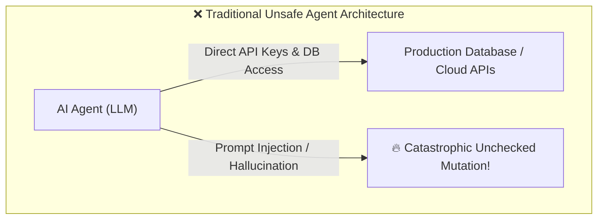
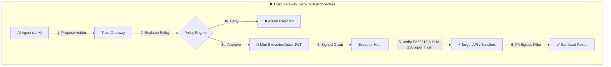
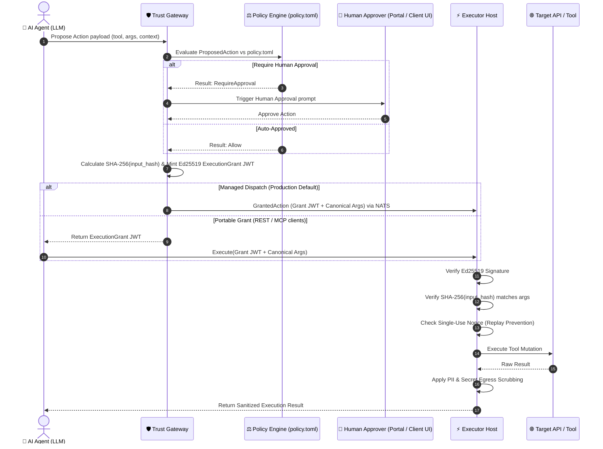

# 🎨 Trust Gateway: 5-Minute Visual Guide & Concepts

Welcome to the **Trust Gateway Visual Guide**. This document explains **why** Trust Gateway exists, **how** it works under the hood, and **where** each concept lives in the codebase.

---

## ⚡ The Core Problem: Why Trust Gateway?

Traditional AI agent frameworks give LLMs direct access to database credentials, cloud APIs, and shell commands. If an agent hallucinates or encounters a prompt injection attack, it can execute catastrophic operations directly.



### The Trust Gateway Solution

`trust-gateway` separates an agent's **intent to act** from the **authority to execute**. The LLM can only *propose* actions. The Gateway evaluates policies, mints cryptographic grants, and the Executor verifies the grant before touching real systems.



---

## 🔄 End-to-End Sequence Diagram

Here is the exact step-by-step control flow for an agent action request:



> **Managed dispatch** is the production default: the Gateway dispatches directly to the Executor via NATS. **Portable grant** mode is available for REST and MCP integrations.

---

## 🧩 Core Concepts & Rosetta Stone

| Concept | What It Does | Codebase Location |
| :--- | :--- | :--- |
| **`ProposedAction`** | The raw intent submitted by the agent ("What I want to do"). | [`crates/trust-model`](../../crates/trust-model) |
| **`Policy Engine`** | Evaluates action attributes against `policy.toml` priority rules. | [`crates/trust-policy`](../../crates/trust-policy) |
| **`ExecutionGrant`** | Short-lived (30s-60s) Ed25519-signed JWT proving authority to execute. | [`crates/trust-grants`](../../crates/trust-grants) |
| **`input_hash`** | SHA-256 digest of canonicalized JSON arguments preventing parameter tampering. | [`crates/trust-canonical`](../../crates/trust-canonical) |
| **`Single-Use Nonce`** | Tracking mechanism ensuring an `ExecutionGrant` can never be reused. | [`gateway/src/grant.rs`](../../gateway/src/grant.rs) |
| **`Executor Host`** | Isolated execution runtime verifying Ed25519 signatures before dispatching tools. | [`executor_host/`](../../executor_host) |
| **`PII Egress Filter`** | Executor-side mandatory regex filter scrubbing API keys, emails, and secrets from results before they leave the execution boundary. | [`crates/trust-egress`](../../crates/trust-egress) |

---

## 🚀 Quick Verification

To see the complete zero-trust control flow run standalone in 3 seconds:

```bash
cd trust-gateway
cargo run -p quickstart-standalone
```
